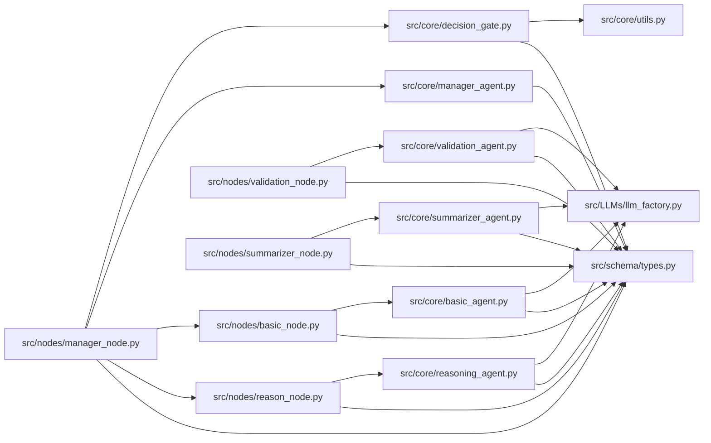

# Finance Decision Reasoning Flow Diagram

Scope used for this diagram:
- `src/core`
- `src/nodes`
- `src/LLMs`
- `src/schema`
- `src/agents` (currently not present in repo)

## 1) Runtime Pipeline Flow

```mermaid
flowchart TD
    A[Input: state.query] --> B[manager_node]
    B --> C{profile in state?}
    C -- no --> D[DecisionGate.decision_func<br/>uses core/utils]
    C -- yes --> E[ManagerAgent.manager]
    D --> E

    E --> F{decision.route}
    F -- unsafe --> U[set final_response via _unsafe_resources_reply<br/>final=true]
    U --> Z([End])

    F -- require_clarification --> Q[set final_response via require_clarification<br/>final=true]
    Q --> Z

    F -- allow_basic and low risk --> G[basic_agent_node]
    G --> H[BasicAgent.run]
    H --> H1[LLMFactory.get_llm().invoke]
    H1 --> I[set facts_response]

    F -- allow_reasoning --> J[reason_llm_node]
    J --> K{reason_counter >= max_reasoning_retries?}
    K -- yes --> K1[set stop message<br/>final=true]
    K1 --> Z
    K -- no --> L[ReasonAgent.run]
    L --> L1[LLMFactory.get_llm().invoke]
    L1 --> M[set reasoning_response + increment reason_counter]

    I --> N[validation_node]
    M --> N
    N --> O[ValidationAgent.run]
    O --> O1[LLMFactory.get_llm().invoke]
    O1 --> O2[json.loads result]
    O2 --> P[set valid_status, valid_reviews, validation_input]

    P --> R{valid_status == pass?}
    R -- no --> S[set validation failure message<br/>final=true]
    S --> Z
    R -- yes --> T[summarizer_node]
    T --> V[SummarizerAgent.run]
    V --> V1[LLMFactory.get_llm().invoke]
    V1 --> W[set final_response<br/>final=true]
    W --> Z
```

## 2) Module Interaction Flow


